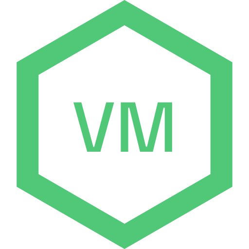

<h1 align="center">
  
</h1>

OpenVM is a simple virtual machine designed for educational purposes. It includes a set of commands
and compilers to execute Oxygen Byte Code (OBC) and provides different types of memory, such as
long-term memory and short-term memory.

> Please read [commands](https://github.com/kad1rr/openvm/blob/master/docs/commands.md)

## Table of Contents

- [Features](#features)
- [Installation](#installation)
- [Usage](#usage)
- [Contributing](#contributing)
- [License](#license)

## Features

- **Oxygen Byte Code (OBC):** Execute programs written in OBC using the OpenVM virtual machine.
- **Long Memory:** Simulate non-resettable accessible memory with the `LongMemory` class.
- **Short-Term Memory (SHM):** Simulate short-term memory with the `SHM` class.
- **Compiler:** Translate between OBC and ORC (Oxygen Readable Code) using the provided compiler.
- **Reader:** Interpret and execute OBC commands using the `Reader` class.

## Installation

```bash
bun i openvm
# or
npm i openvm
# or
yarn add openvm
# or
pnpm i openvm
```

## Usage

```javascript
import { VM } from '../src/openvm.js'
import fs from 'fs'

const vm = new VM()
const file = fs.readFileSync('./test/your-file.o', {
  encoding: 'utf8',
})
vm.run(file)
```

Just import your Oxygen Readable Code file and create a new VM instance. Now you are ready to run
your code.

`your-file.o`

```oxygen
; Now you are can use comments!
jmp 0x0                 ; Set cursor to 0x0
set hello%20world       ; Set 0x0 to hello world (%20 equals to space)
jmp 0x1                 ; Set cursor to 0x1
set put%200x0           ; Setting 0x1 to command put 0x0 (%20 equals to space)
run 0x1                 ; Run 0x1
exit 0                  ; Exit the program without errors
```

## License

[MIT](https://github.com/kad1rr/openvm/blob/master/LICENSE)
